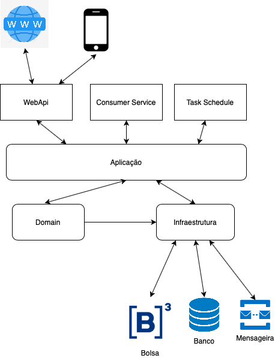
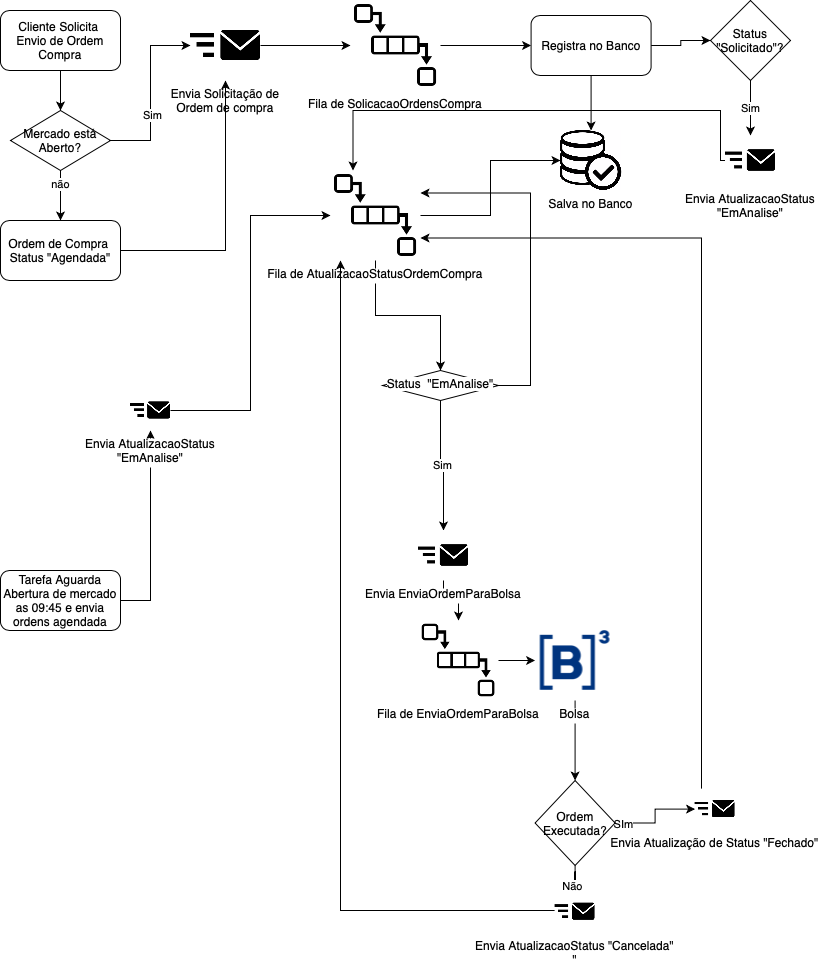

# renda-variavel-oms
Projeto DDD para um sistema de solicitação de ordens de compra (OMS)

Projeto em .Net core 2.2 utilizando sistemas de mensageria para disparo de eventos e banco de dados SQL para persistencia

Hospedagem pode ser feito tanto no AWS ou AZURE
usando docker e containers 

Nomenclatura do codigo em portugues, pois se trata de uma corretora nacional, com clientes nacionais e também facilita a comunicação com negocio e o time técnico.

Desenho solução e camadas

Fluxograma

